# This is the Readme file for Group #3 Project #2
Bootcamp: Columbia Fintech 
Cohort: March-Sep 2021 
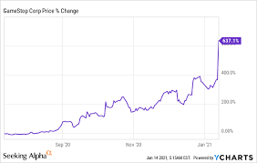
## Goal
Determine it is possible to determine a stocks movement by looking at comments on Wall Street Bets (WSB) on Reddit. The project was more an investigation of possible approaches than a final production produt.
## Rationale
WSB was a forum to start short squeeze on stock being shorted by Hedge Funds
[wsb short squeeeze]
## Approach
We took the follow steps to develop senstivity scenarios (what-if)
1. [Read WSB](#1---Read-WSB)
2. [Data Wrangling](#2---Data-Wrangling)
3. [Run LSTM Scenarios on Data](#3---Run-LSTM-Scenarios)
4. [Evalute other ML Models](#4---Evalute-other-ML-Models)
5. [Other](#5---Other)

### 1 - Read WSB
(Ludo)

### 2 - Data Wrangling 
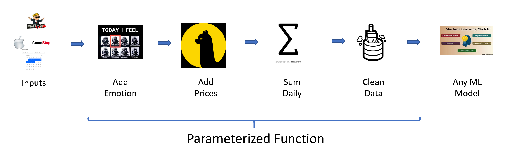
2.1. read WSB Data 
The first step is to read the WSB into a dataframe
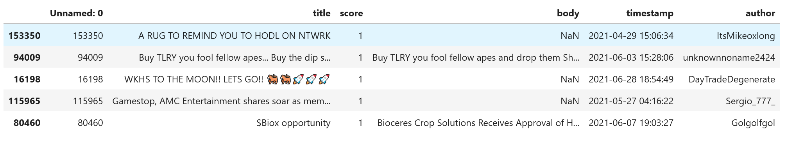
2.2. Add sentiment Data  
We then add sentiment data  

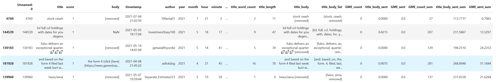
The derived columns of interest are: 
* 'date' - the date of the message. 
* 'title_body' - combined text of title and body
* 'GME_count' - count how how many times the ticker (GME) was mentioned  
* 'title_body_sent' - overall sentiment of title and body 
* 'GME_sent' - sentiment of text mentioning ticker (GME)  
* 'title_body_sent_sum' - sum of daily sentiment in title and body 
* 'GME_sent_sum' - sum of daily sentiment of text mentioning GME 

 
2.3. add stock data from alpaca 
We then read the stock data from Alpaca

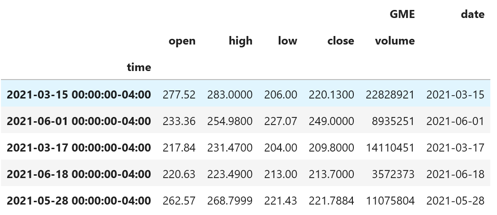
2.4. Data Output
We then create a DataFrame feeding into Machine Learning 
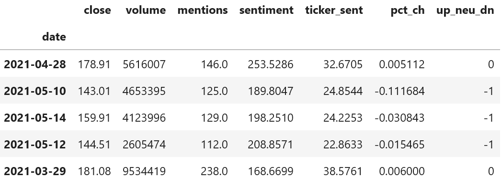
all numbers daily 
* 'mentions' - number of mentions of ticker
* 'sentiment' - overall sentiment
* 'ticker_sent' - ticker sentiment
* 'pct_ch' - percent change of ticker price
* 'up_neu_dn' - is stuck up (+1) down (-1) or neutral (0)

### 3 - Run LSTM Scenarios 
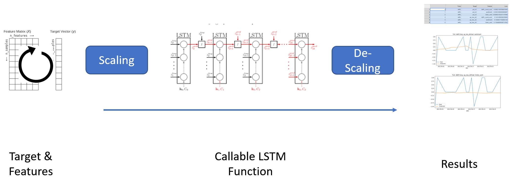
3.1 We test the data with an LSTM Model with the following paramters: 
* Test/Train Split = 70/30
* model = Sequential()
* number_units = 5
* dropout_fraction = 0.2
* 4 layer with single output layer

To run the LSTM scenarios: 
3.2 We first import stock data and create the ML Data as described above 
ml_df = fetch_data ('GME', '2021-01-28', '2021-06-28' ) 
3.3. We then create a feature list and a target list and select a stock from a ticker list 
* targ_list = ['pct_ch', 'up_neu_dn'] 
* feat_list = [cur_tick + count_sufx] + feat_tmplt 
3.4. Loop through them to get output with the following fucnction: 
cur_loss = run_lstm(ml_df, cur_feat, cur_targ, fname , title) 
3.5 tabulate the output:  
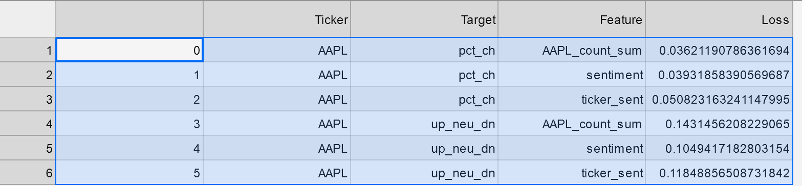
3.6 As can be seen from charting results, this needs a lot more experimentation:
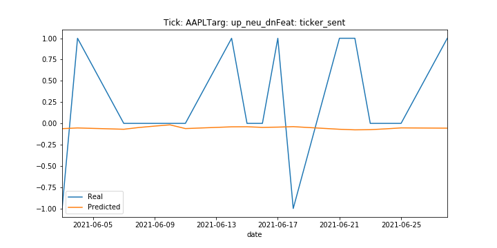
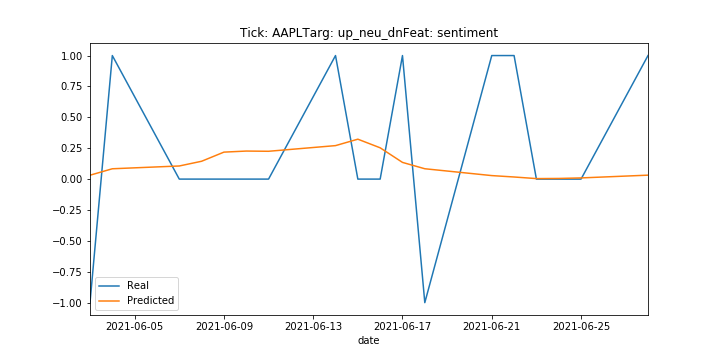
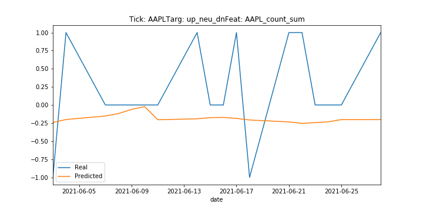
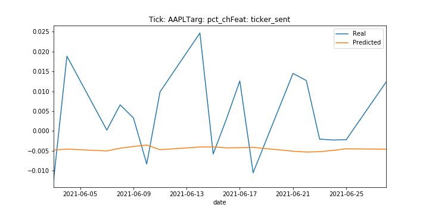
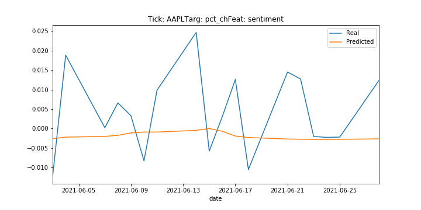
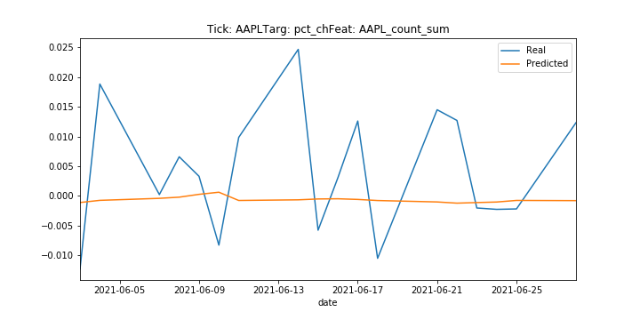

### 4 - Evalute other ML Models
(Jimmy)

### 5 - Other
(TBD)
