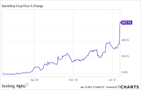

# Project2 (grp3): WSbets Sentiment Analysis and Stock Price Prediction
Bootcamp: Columbia Fintech<br>
Cohort: March–Sep 2021<br>

## 2026 refresh: latest top 10 WallStreetBets stocks

This repository now includes a runnable refresh pipeline that:

- pulls the latest public `r/wallstreetbets` posts without requiring Reddit credentials,
- extracts and validates ticker mentions against Yahoo Finance,
- ranks the latest top 10 discussed stocks,
- computes current price analysis for each ticker using rolling statistics, RSI, MACD, and a linear-regression RMSE,
- saves fresh CSV, JSON, Markdown, and PNG outputs under `outputs/latest_wsb_analysis/`.

### Quick start

Use the project virtual environment and install the dependencies from `requirements.txt`.
For TensorFlow compatibility on Windows, Python `3.12` is the safest choice for this project.

```powershell
Set-Location "C:\Users\big_j\PycharmProjects\Project2-Sentiment-analysis-WSbets"
.\.venv\Scripts\Activate.ps1
python -m pip install -r requirements.txt
python -m nltk.downloader punkt stopwords wordnet omw-1.4 vader_lexicon
python run_latest_analysis.py
```

### Optional arguments

```powershell
python run_latest_analysis.py --top-n 10 --per-feed 100 --price-period 1y
```

### Fresh output files

- `outputs/latest_wsb_analysis/latest_wsb_posts.csv`
- `outputs/latest_wsb_analysis/latest_wsb_mentions.csv`
- `outputs/latest_wsb_analysis/top10_wsb_stocks.csv`
- `outputs/latest_wsb_analysis/top10_summary.json`
- `outputs/latest_wsb_analysis/top10_summary.md`
- `outputs/latest_wsb_analysis/financial_metrics_summary.csv`
- `outputs/latest_wsb_analysis/pytorch_lstm_summary.csv`
- `outputs/latest_wsb_analysis/wsb_word_sentiment_summary.csv`
- `outputs/latest_wsb_analysis/charts/top10_mentions_and_sentiment.png`
- `outputs/latest_wsb_analysis/charts/top10_relative_performance.png`
- `outputs/latest_wsb_analysis/charts/*_dashboard.png`

### Runnable notebooks

All primary notebooks in this repository have been refreshed to run against the current public-data workflow.
They no longer depend on Pushshift, Alpaca credentials, or legacy local `.env` files.

Recommended notebook run order:

1. `Reddit_API_Data.ipynb`
   - refreshes the latest public `r/wallstreetbets` post dataset
   - writes updated root CSVs (`wsb_reddit_api_data.csv`, `wsb_pushshift_data.csv`)
   - writes current outputs to `outputs/latest_wsb_analysis/`
2. `WSBets_Sentiment_Analysis.ipynb`
   - builds a live-merged sentiment and market dataset for the latest top ticker
   - runs a lightweight LSTM notebook workflow
3. `financial_metrics.ipynb`
   - analyzes the current top WSB tickers with rolling stats, RSI, MACD, and regression RMSE
4. `word_sentiment_of_reddit_wsb.ipynb`
   - computes title/body sentiment summaries and word clouds from the latest WSB posts
5. `stock_prediction_with_PyTorch.ipynb`
   - trains a compact PyTorch LSTM on the latest top WSB tickers

### Execute all notebooks from the terminal

```powershell
Set-Location "C:\Users\big_j\PycharmProjects\Project2-Sentiment-analysis-WSbets"
.\.venv\Scripts\Activate.ps1
python -m jupyter nbconvert --to notebook --execute "Reddit_API_Data.ipynb" --output "Reddit_API_Data.executed.ipynb" --ExecutePreprocessor.timeout=1200
python -m jupyter nbconvert --to notebook --execute "WSBets_Sentiment_Analysis.ipynb" --output "WSBets_Sentiment_Analysis.executed.ipynb" --ExecutePreprocessor.timeout=1200
python -m jupyter nbconvert --to notebook --execute "financial_metrics.ipynb" --output "financial_metrics.executed.ipynb" --ExecutePreprocessor.timeout=1200
python -m jupyter nbconvert --to notebook --execute "word_sentiment_of_reddit_wsb.ipynb" --output "word_sentiment_of_reddit_wsb.executed.ipynb" --ExecutePreprocessor.timeout=1200
python -m jupyter nbconvert --to notebook --execute "stock_prediction_with_PyTorch.ipynb" --output "stock_prediction_with_PyTorch.executed.ipynb" --ExecutePreprocessor.timeout=1200
```

### GitHub Actions daily refresh

This repository includes a scheduled workflow at `.github/workflows/daily-analysis.yml`.

- runs once per day and also supports manual runs with `workflow_dispatch`,
- installs dependencies and required NLTK corpora,
- runs `run_latest_analysis.py` to fetch and enrich the latest WSB data,
- executes primary notebooks (`WSBets_Sentiment_Analysis.ipynb`, `financial_metrics.ipynb`, `word_sentiment_of_reddit_wsb.ipynb`, `stock_prediction_with_PyTorch.ipynb`) against the refreshed data with `WSB_REFRESH_DATA=0` to avoid re-fetching,
- updates the README Top 10 snapshot section,
- uploads outputs and executed notebooks as workflow artifacts,
- commits refreshed outputs back to the repository when changes are detected.

The auto-generated Top 10 snapshot section is generated by `scripts/update_readme_top10.py`.

Note: `Reddit_API_Data.ipynb` is available for manual runs to refresh legacy CSV formats (`wsb_reddit_api_data.csv`, `wsb_pushshift_data.csv`), but is not executed by the automated workflow since the pipeline handles Reddit data fetching.

### Important note about the older README sections below

The remainder of this README preserves the original 2021 project narrative for historical context.
Those sections still describe the original Pushshift, direct Reddit OAuth, and Alpaca-based workflow.
For the current runnable project, use the refresh pipeline and notebook workflow documented above instead.

**Creators:**
* [Hassan Alam](https://www.linkedin.com/in/hassanalammitstanfordgsb/)
* [Julian Lopez](https://www.linkedin.com/in/julianlopez21/)
* [Jimmy Unelus](https://www.linkedin.com/in/jimmy-unelus/)
* [Ludovic Schneider](https://www.linkedin.com/in/ludovic-schneider-06aa6415/?locale=en)

## Goal

Determine if it is possible to predict stock price action by analyzing comments in the "famous" WallStreetBets (WSB) Subreddit group by applying Natural Language Programing (NLP) and Machine learning models (including Long Short-Term Memory — LSTM). The project was more an investigation of possible approaches than a final production product. The idea was to assess and compare the value of WSB (unconventional data inputs for trading models) Vs traditional prices and financial indicators.

## Rational

WSB was a forum initially created for retail investors to exchange trade ideas. It became "famous" in early 2021 with the GME story and its short squeeze strategy. WSB has over 10 million subscribers. Individual investors would share ideas and joint forces in risky bets like the short squeeze where they pick the stocks that have the most short open position and together start to buy them to "squeeze" the Institutions (often large Hedge Funds) being short the stocks and forced to buy them back.

## Historical 2021 workflow summary

The original project explored several approaches that are now preserved mainly for historical context:

- collecting Reddit data with direct Reddit API and Pushshift,
- combining ticker mentions with price moves,
- generating sentiment-focused word clouds,
- experimenting with TensorFlow and PyTorch LSTMs,
- evaluating linear regression against technical indicators.

Those original ideas are still reflected in the refreshed notebooks, but the current project now uses public Reddit JSON feeds and Yahoo Finance instead of the older Pushshift / Alpaca path.

### References:

Trending stocks and cryptos on Reddit Wallstreetbets: 
https://trade-tip.com/reddit-sentiment-wallstreetbets.html

https://www.kaggle.com/sprakshith/beginner-s-guide-to-sentiment-analysis

https://www.kaggle.com/thomaskonstantin/reddit-wallstreetbets-posts-sentiment-analysis

Reddit API : https://github.com/reddit-archive/reddit/wiki/API

Pushift API : https://psaw.readthedocs.io/en/latest/ and https://pushshift.io

PyTorch : https://pytorch.org/

Stock Price Prediction with PyTorch: https://medium.com/swlh/stock-price-prediction-with-pytorch-37f52ae84632

<!-- AUTO_TOP10_START -->
## Latest Top 10 Snapshot (Auto-updated)

- Generated at (UTC): `2026-07-06T23:34:18.585091+00:00`
- Data source: `reddit_authenticated_api`
- Raw outputs:
  - `outputs/latest_wsb_analysis/top10_wsb_stocks.csv`
  - `outputs/latest_wsb_analysis/top10_summary.json`
  - `outputs/latest_wsb_analysis/top10_summary.md`

### Summary

See `outputs/latest_wsb_analysis/top10_summary.md` for the narrative market snapshot.

### Top 10 Table

| Rank | Ticker | Mentions | Posts | Avg Sentiment | Last Close | 21D Return | RMSE |
| --- | --- | ---: | ---: | ---: | ---: | ---: | ---: |
| 1 | WEN | 9 | 6 | 0.361 | 7.90 | 15.33% | 0.306 |
| 2 | NVDA | 6 | 5 | 0.119 | 195.55 | -8.94% | 4.017 |
| 3 | AMD | 9 | 3 | 0.041 | 552.05 | 1.76% | 24.735 |
| 4 | ZIM | 15 | 1 | 0.994 | 23.71 | -3.22% | 0.634 |
| 5 | RKLB | 4 | 3 | 0.281 | 93.09 | -18.84% | 7.973 |
| 6 | NBIS | 3 | 3 | 0.355 | 213.02 | -15.36% | 13.215 |
| 7 | AVAV | 5 | 2 | 0.257 | 176.84 | -7.64% | 7.350 |
| 8 | MSTR | 4 | 2 | -0.355 | 100.77 | -20.37% | 17.075 |
| 9 | HOOD | 4 | 2 | 0.581 | 117.55 | 41.88% | 2.753 |
| 10 | RDDT | 4 | 2 | 0.707 | 200.86 | 18.51% | 7.980 |

### Aggregate Charts

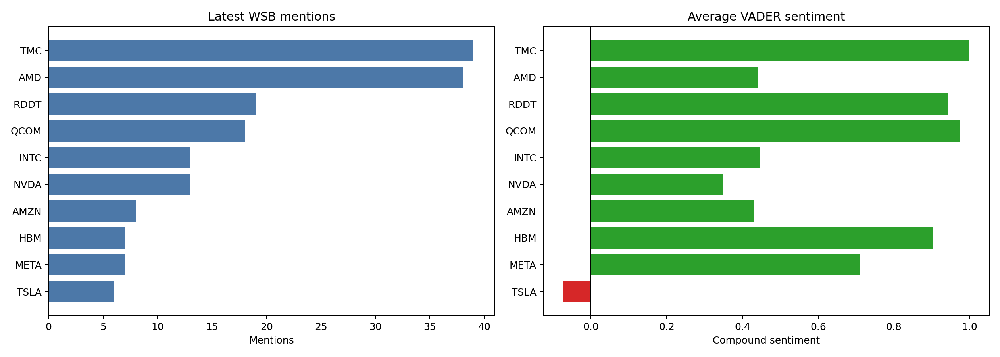

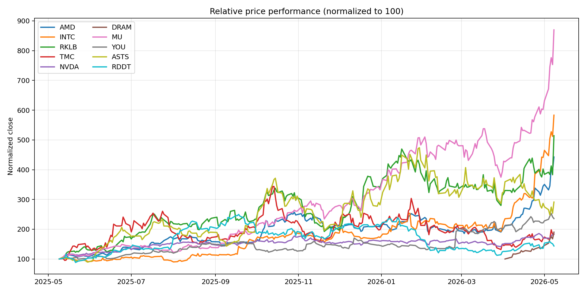

### Per-Ticker Dashboards

#### WEN

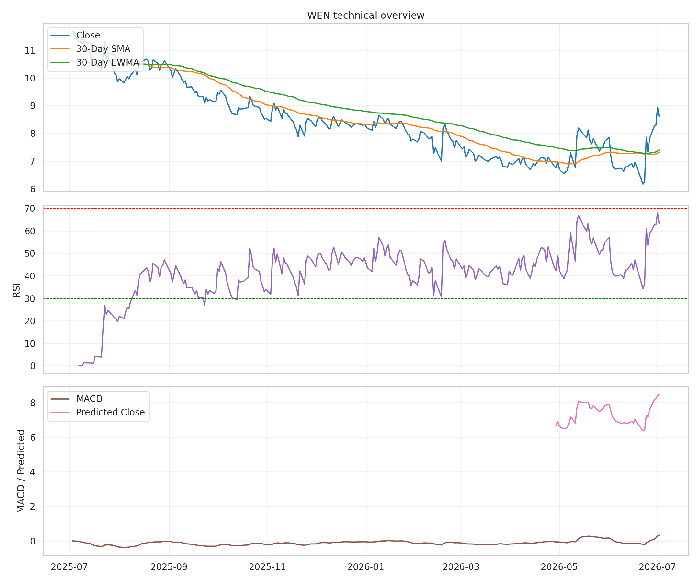

#### NVDA

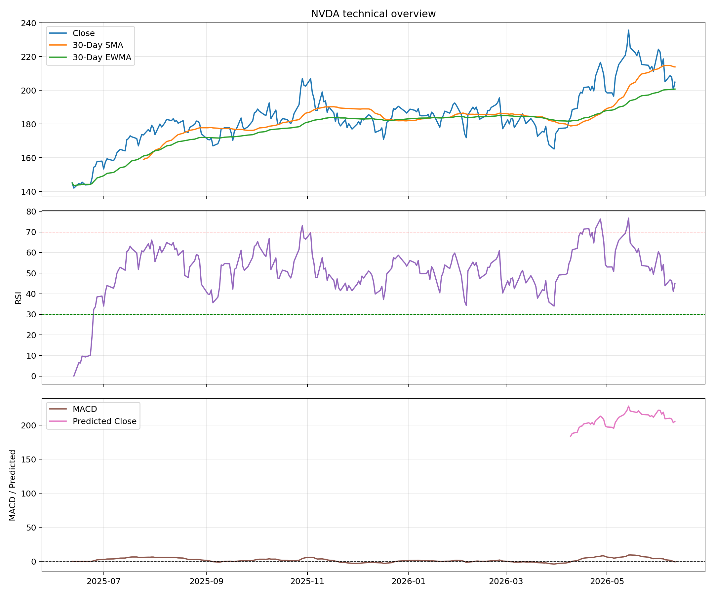

#### AMD

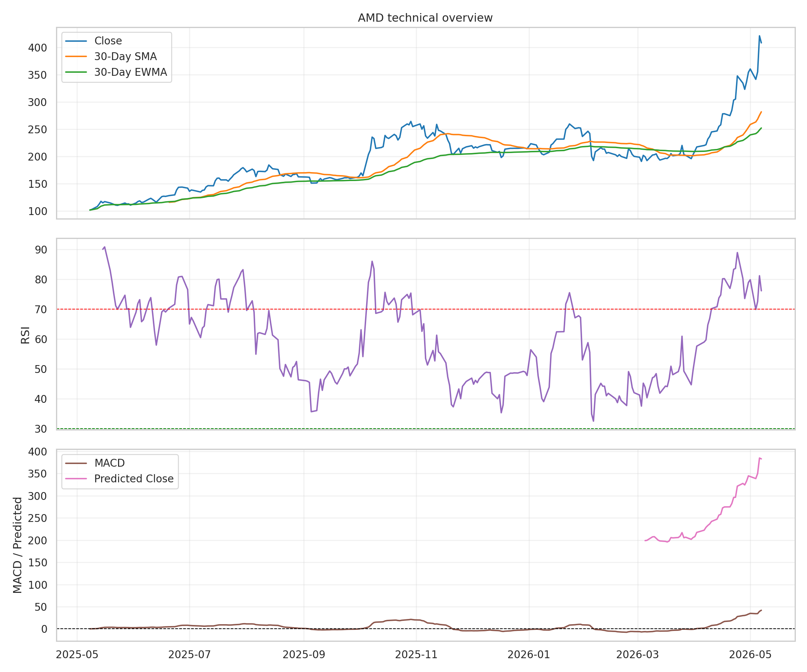

#### ZIM

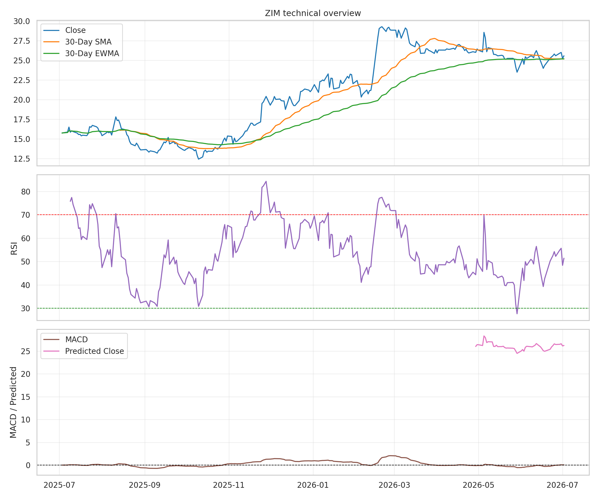

#### RKLB

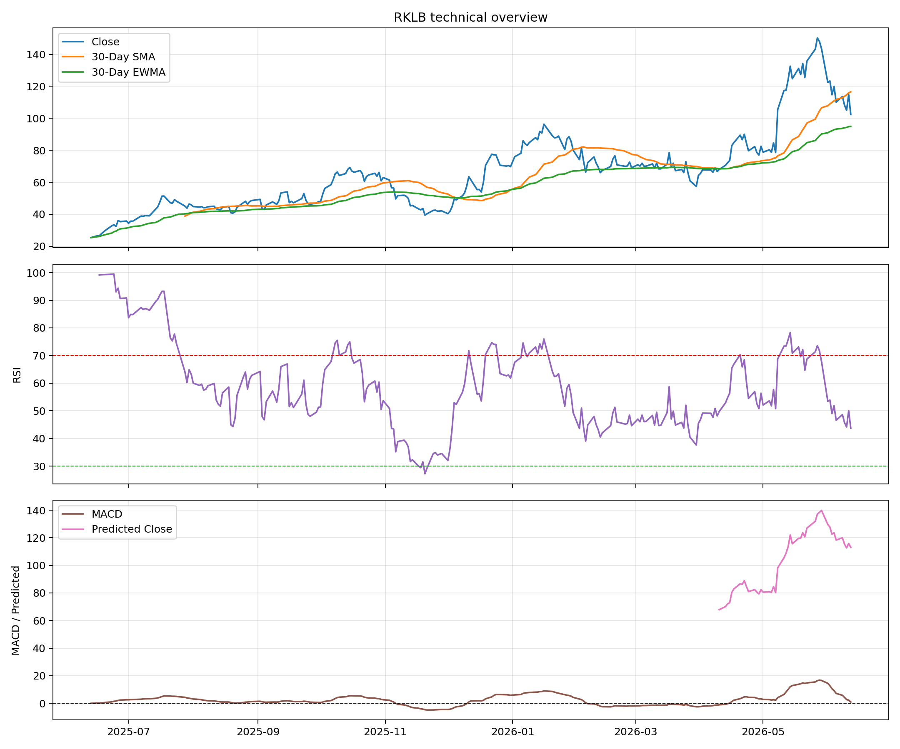

#### NBIS

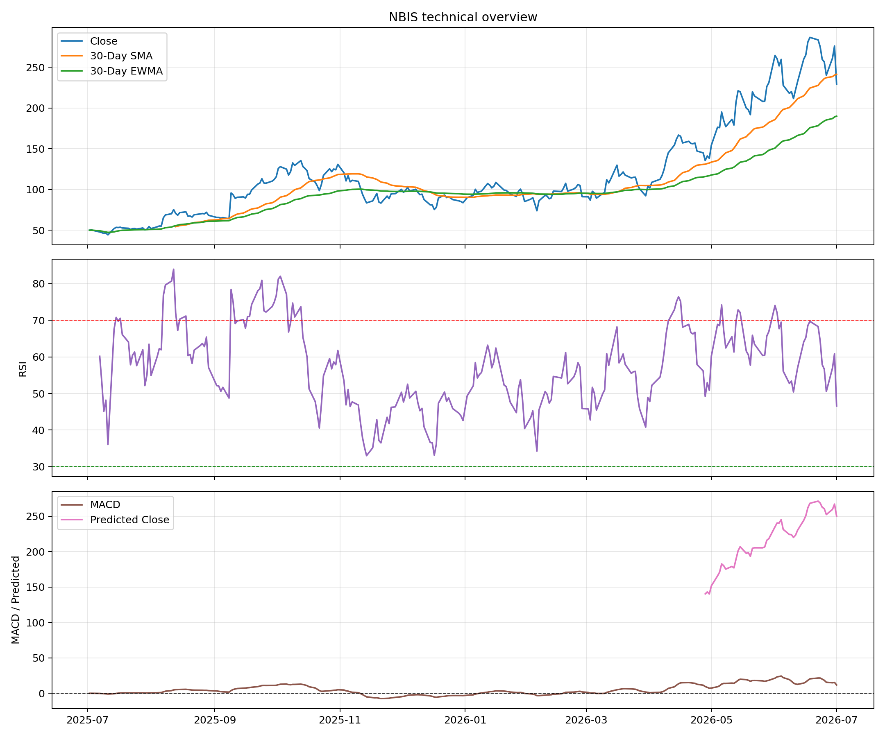

#### AVAV

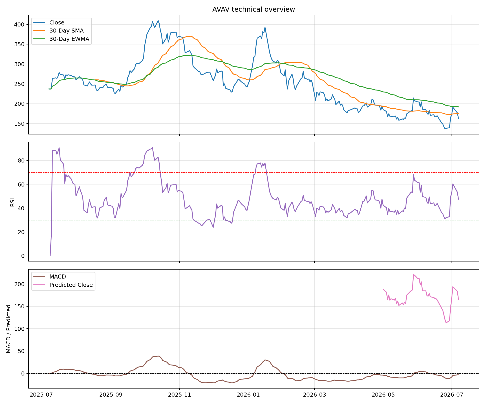

#### MSTR

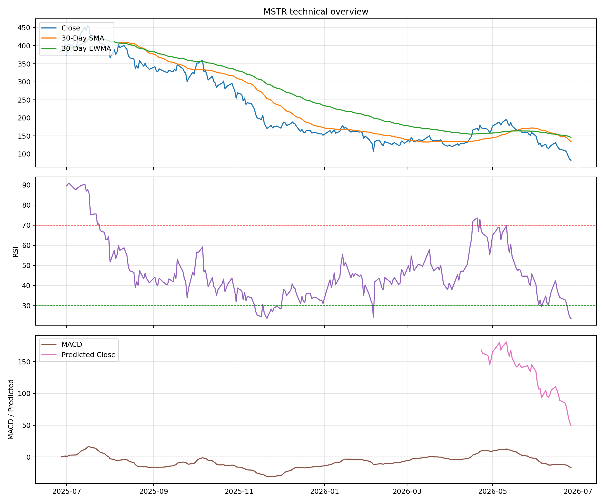

#### HOOD

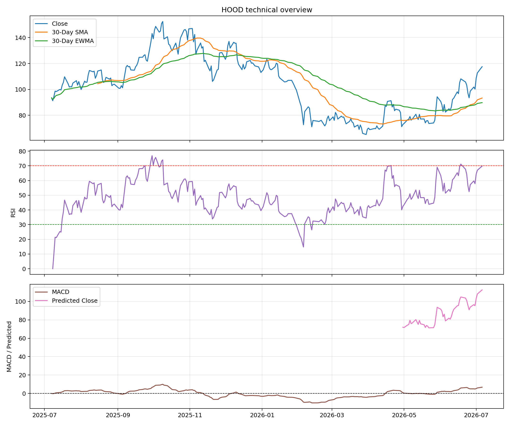

#### RDDT

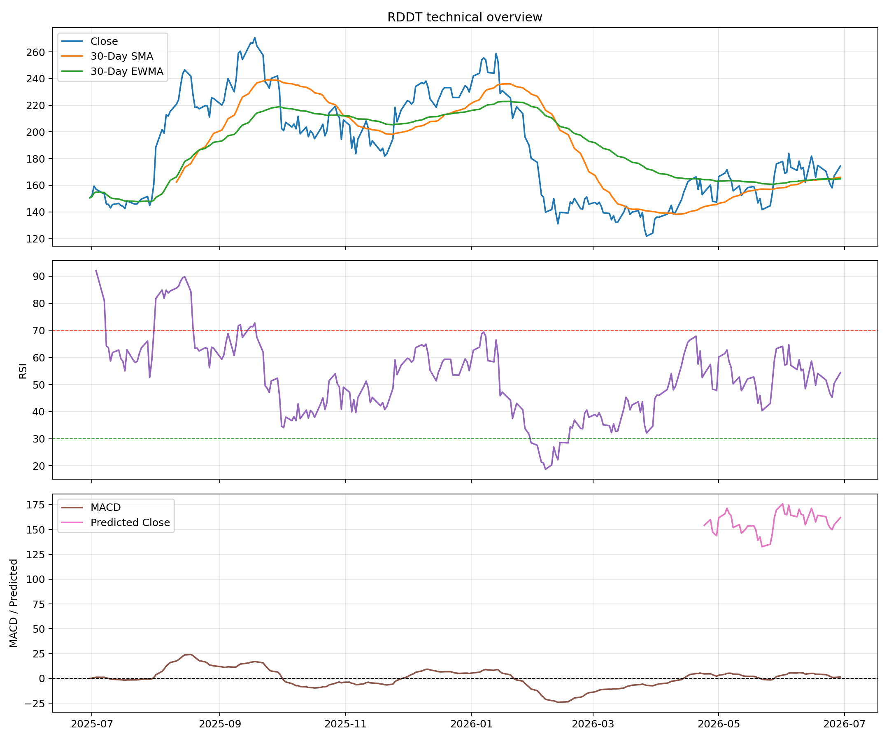
<!-- AUTO_TOP10_END -->
