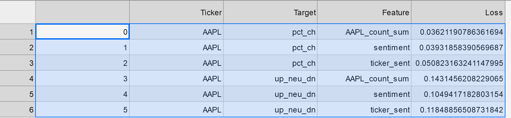

# Project2 (grp3): WSbets Sentiment Analysis and stock price prediction
Bootcamp: Columbia Fintech 
Cohort: March-Sep 2021 

**Creators:**
* Hassan Alam
* Julian Lopez
* Jimmy Unelus
* Ludovic Schneider

## Goal

Determine if it is possible to predict stocks price action by analysing comments in teh "famous" WallStreetBets (WSB) Subreddit group by applying Natural Language Programing (NLP) and Machine leanring models (including Long Short Term Memory -LSTM . The project was more an investigation of possible approaches than a final production produt. The idea was to asses and compare the value of WSB (unconventional data inputs for trading models) Vs traditional prices and finantial indicators.

## Rational

WSB was a forum intially created for retail investor to exchange trades ideas. It became "famous" in early 2021 with the GME story and its short squeeze strategy. WSB has over 10mio subscribers and individual investors would share ideas and joint forces in risky bets like the short squeeze where they pick the stocks that have the most short open position and together start to buy them to "squeeze" the Institutions (often large Hedge Funds) being short teh stocks and forced to buy it back.

## Approach / Table of content

We took the follow steps to develop senstivity scenarios (what-if)
- [Project2 (grp3): WSbets Sentiment Analysis and stock price prediction](#project2-grp3-wsbets-sentiment-analysis-and-stock-price-prediction)
  - [Goal](#goal)
  - [Rational](#rational)
  - [Approach / Table of content](#approach--table-of-content)
    - [1 - Read WSB : API](#1---read-wsb--api)
    - [2 - Data Wrangling](#2---data-wrangling)
    - [3 - Run LSTM Scenarios](#3---run-lstm-scenarios)
    - [4 - Evalute other ML Models](#4---evalute-other-ml-models)
    - [5 - Other](#5---other)
    - [6 - Sources](#6---sources)

### 1 - Read WSB : API

As a user, the first thing you need to do is to create a Reddit account and join/request access to the subreddit that you want to analyse. In our case it is WSBest. Note thic group is now private and hence it might take several days before you get approved. 

1.1. First API: Retrieving the data via Reddit API directly

It is not the best way to retrieve large dataset but it is a good way to stream/retrieve data in real time. It is also one of the only solution to access all the updates of each post. So if you need/want to keep all the information about a post (comments - votes - score...) you probably want to use this methodology.

The constraints of this API is that you are limited to 100 posts per requests. Hence we had to create a loop to allow the user to go back in time as much as desired by batches of 100 posts. This limitation makes it harder and a lot longer to build a large enough dataset to feed our machine learning experimentation.

Therefore we decided to use a different methodology/API to build our dataset. However we still wanted to give the user the flexibility to actually use this API especially if the user wants to retrieve the posts AND the comments/votes...happening afterwards. The user can also adjust the code to create a "live" feed of the last 100 WSBets posts.

We Created a function called: **reddit_direct_api(subreddit, max_batch, limit_posts)**
To run the function the user needs Reddit API keys and  Reddit account password saved in an .env
format : 
    client_id = os.getenv("REDDIT_CLIENT_ID")
    reddit_secret_key = os.getenv("REDDIT_SECRET_KEY")
    reddit_pw = os.getenv('REDDIT_PW')
To create your keys you need to create an account a "program" via the link https://www.reddit.com/prefs/apps.

2.2. Second API: Retrieving the data via the Pushift Databse

For this API, we used the wraper PSAW: Python Pushshift.io API Wrapper

Pushift is a database built for users looking to extract a large amount of data - posts. The database is updated realtime as soon as a new post is submitted to Reddit. However this is a one time transfer and hence this databse is missing all the "events" happening after its initial submission. Therefore PSAW is missing the score information, comments ...
We still decided to go with this API as it allowed us to build a very large amount of data relatively quickly. The file we created and used for the future analysis contains 200k rows.

We created the function: **pushiftapi (subreddit, start_year, start_month, start_date, end_year, end_month, end_date, max_posts)**

### 2 - Data Wrangling

2.1. read WSB Data 
The first step is to read the WSB into a dataframe

2.2. Add sentiment Data  
We then add sentiment data  

The derived columns of interest are: 
* 'date' - the date of the message. 
* 'title_body' - combined text of title and body
* 'GME_count' - count how how many times the ticker (GME) was mentioned  
* 'title_body_sent' - overall sentiment of title and body 
* 'GME_sent' - sentiment of text mentioning ticker (GME)  
* 'title_body_sent_sum' - sum of daily sentiment in title and body 
* 'GME_sent_sum' - sum of daily sentiment of text mentioning GME 

 
3. add stock data from alpaca 
We then read the stock data from Alpaca

4. Data Output
We then create a DataFrame feeding into Machine Learning 

all numbers daily 
* 'mentions' - number of mentions of ticker
* 'sentiment' - overall sentiment
* 'ticker_sent' - ticker sentiment
* 'pct_ch' - percent change of ticker price
* 'up_neu_dn' - is stuck up (+1) down (-1) or neutral (0)

### 3 - Run LSTM Scenarios
(Hassan)
3.1 We test the data with an LSTM Model with the following paramters: 
* Test/Train Split = 70/30
* model = Sequential()
* number_units = 5
* dropout_fraction = 0.2
* 4 layer with single output layer

To run the LSTM scenarios:
3.2 We first import stock data and create the ML Data as described above 
ml_df = fetch_data ('GME', '2021-01-28', '2021-06-28' ) 
3.3. We then create a feature list and a target list and select a stock from a ticker list 
* targ_list = ['pct_ch', 'up_neu_dn'] 
* feat_list = [cur_tick + count_sufx] + feat_tmplt 
3.4. Loop through them to get output with the following fucnction: 
cur_loss = run_lstm(ml_df, cur_feat, cur_targ, fname , title) 
3.5 tabulate the output:  

3.6 As can be seen from charting results, this needs a lot more experimentation:

### 4 - Evalute other ML Models
(Jeremy)

### 5 - Other
(TBD)

### 6 - Sources

Reddit API : https://github.com/reddit-archive/reddit/wiki/API
Pushift API : https://psaw.readthedocs.io/en/latest/ and https://pushshift.io/
